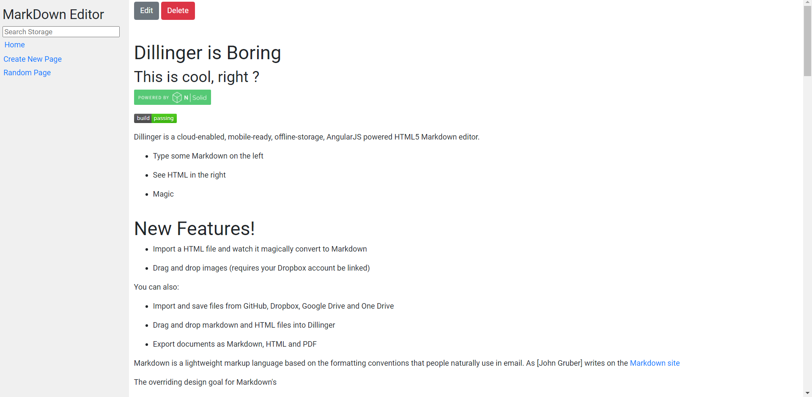

# Markdown Editor
A simple Markdown Editor Web App 

This is a simple Markdown Editor App (something like Dillinger) but used the markdown2 python library and is build with Django.

## Working



## Features

- Used Markdown2 [Library](https://pypi.org/project/markdown2/)
- CRUD
- Simple UI
- Uses local Storage

## Setup

- Download the files from this repo
- Change the directory to the folder where you downloaded files
- For installing required packages, execute the following command in terminal:

    ```bash
    $pip install -r requirements.txt
    ```

- Generate a Secret Key, you can use [this](https://miniwebtool.com/django-secret-key-generator/).
- After successful installation execute the following commands:

    ```bash
    $touch .env
    $echo "SECRET_KEY=yourkey" >> .env
    $python manage.py migrate
    $python manage.py runserver
    ```

- Visit `127.0.0.1:8000` in your browser to enjoy the awesome app!

Built with ♥ by [`Animesh Singh`](http://github.com/AnimeshRy)
